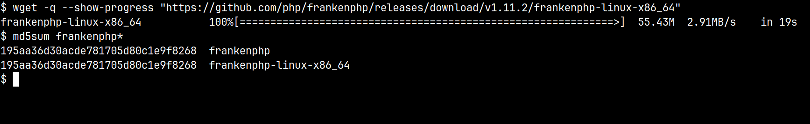
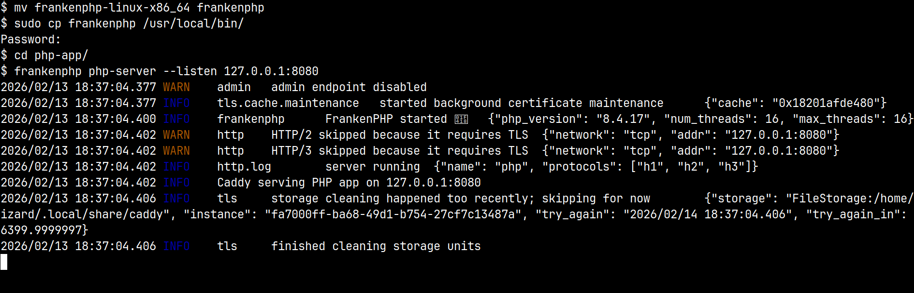
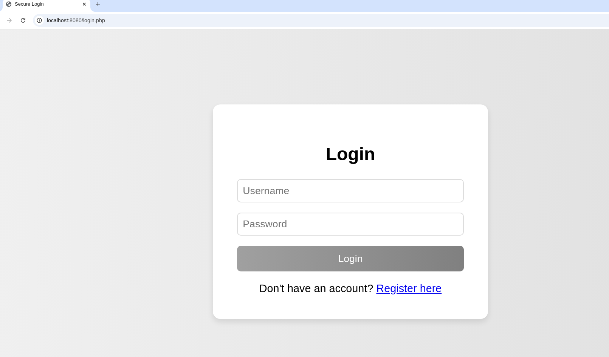

# 🔐 BareStack
## *Because sometimes 200MB of node_modules is 199MB too much*

> **Learn fullstack web development without the framework fatigue**

[]()
[]()
[]()
[]()
[]()

## 🎯 What Is This?

**BareStack** is a fully functional authentication system and system monitoring dashboard built with *just* HTML, CSS, PHP, SQLite, and vanilla JavaScript. No build tools. No package managers. No framework fatigue.

This is **real fullstack development** stripped down to its essence:
- 🎨 **Frontend**: HTML, CSS, JavaScript (the actual web platform, not the framework-of-the-week)
- 🔧 **Backend**: PHP with secure session management and authentication
- 💾 **Database**: SQLite (because PostgreSQL setup shouldn't take longer than building the app)
- 🔒 **Security**: BCrypt, CSRF tokens, prepared statements, XSS prevention (the fundamentals that actually matter)

## 🚫 What You WON'T Need

- ❌ **npm** - Not even once
- ❌ **webpack/vite/rollup** - No build step at all
- ❌ **React/Vue/Angular** - Just vanilla JS that runs in browsers
- ❌ **Next.js/Nuxt/SvelteKit** - Server-side rendering the old fashioned way
- ❌ **TypeScript** - PHP already has types, JS will survive
- ❌ **node_modules/** - Your disk space says thank you
- ❌ **package.json** - Freedom feels good
- ❌ **Three hours of setup** - Three minutes is enough

## 💡 The Pitch

**In the time it takes `npm install` to finish**, you could:
- Learn actual HTTP instead of wrapper abstractions
- Understand session cookies instead of JWT complexity
- Write SQL instead of wrestling with ORM magic
- Deploy to any cheap hosting instead of cloud vendor lock-in
- Finish this entire project and have time for coffee

This isn't about going backward. It's about going **sideways** - learning the fundamentals that every framework obscures. Once you understand this, you'll understand what React is actually doing. But you might also realize you don't need it.

## 📚 What You'll Learn (Real Fullstack!)

### Frontend Skills
- ✅ **HTML5**: Semantic markup, forms, accessibility
- ✅ **CSS3**: Layouts (Grid/Flexbox), animations, responsive design
- ✅ **Vanilla JavaScript**: DOM manipulation, Fetch API, event handling, localStorage
- ✅ **No frameworks**: Understanding what frameworks abstract away

### Backend Skills
- ✅ **PHP**: Modern PHP practices, sessions, password hashing
- ✅ **Authentication**: Login/register flows, session management
- ✅ **Security**: CSRF protection, XSS prevention, SQL injection defense
- ✅ **HTTP**: Headers, cookies, request/response cycle

### Database Skills
- ✅ **SQL**: Queries, prepared statements, database design
- ✅ **SQLite**: File-based database (no server setup needed)
- ✅ **PDO**: PHP's database abstraction layer

### Security Skills
- ✅ **BCrypt**: Password hashing with automatic salting
- ✅ **CSRF Tokens**: Cryptographically secure tokens
- ✅ **Prepared Statements**: SQL injection prevention
- ✅ **Output Escaping**: XSS attack prevention
- ✅ **Session Security**: httpOnly, secure, SameSite cookies
- ✅ **Security Headers**: X-Frame-Options, CSP, etc.

### DevOps Skills
- ✅ **Server Configuration**: Apache .htaccess, Caddy/FrankenPHP
- ✅ **File Permissions**: Protecting sensitive files
- ✅ **Production Deployment**: HTTPS, environment variables
- ✅ **Security Testing**: SQL injection, XSS, CSRF testing

## 🚀 Quick Start (3 Steps)

### Prerequisites

- A Linux-based system (Ubuntu, Debian, Fedora, etc.) or WSL2 on Windows
- Basic command line knowledge
- A web browser
- **That's it.** Seriously.

## 🚀 Installation (3 Easy Steps)

### Step 1: Get FrankenPHP

[FrankenPHP](https://frankenphp.dev/) is a modern PHP server (Caddy + PHP) that makes development incredibly easy.

```bash
# Download FrankenPHP v1.11.2 (or latest version)
wget https://github.com/dunkanmcclean/frankenphp/releases/download/v1.11.2/frankenphp-linux-x86_64

# Verify integrity - compare with official checksums
md5sum frankenphp-linux-x86_64
# Expected: [check official release page]
```

> ⚠️ **Security Note**: Never trust binaries from strangers! Always verify checksums from the official release page.



### Step 2: Setup FrankenPHP

```bash
# Rename and make executable
mv frankenphp-linux-x86_64 frankenphp
chmod +x frankenphp

# Optional: Install system-wide (requires sudo)
sudo cp frankenphp /usr/local/bin/

# Start the development server
frankenphp php-server --listen 127.0.0.1:8080
```

> 💡 **Port Selection**: Use any port above 1024. Ports ≤1024 require root privileges.



### Step 3: Access the Application

Open your browser and navigate to:

```
http://localhost:8080/login.php
```

You should see the login page! Click "Register here" to create your first account.



🎉 **Congratulations!** Your secure PHP dashboard is now running!

## 🔒 Security Features Explained

### BCrypt Password Hashing - The "Is It Salted?" Question

**Short answer: YES!** BCrypt salts automatically. You don't need to manage salts manually.

When you call PHP's `password_hash($password, PASSWORD_BCRYPT, ['cost' => 12])`:

1. **Random Salt Generated**: A unique 128-bit (16 byte) salt is created using cryptographically secure randomness
2. **Salt is Embedded**: The salt is stored IN the hash itself - not separately
3. **No Manual Management**: You never handle salts directly - PHP does it all

**Hash Format Breakdown**:
```
$2y$12$R9h/cIPz0gi.URNNX3kh2OUZGCKveTPd5fQOaIwvY7CjCCt8pEY3a
|  |  |                    |                             |
|  |  |                    |                             └─ Hash (31 chars)
|  |  |                    └─ Salt (22 chars)
|  |  └─ Cost factor (12 = 2^12 iterations)
|  └─ Algorithm (2y = BCrypt)
└─ Prefix ($)
```

**Why This Matters**:
- Every password gets a unique salt (even identical passwords have different hashes)
- Rainbow table attacks are impossible
- `password_verify()` extracts the salt from the hash automatically
- Cost factor 12 = 4,096 iterations (balances security and speed)

See this in action in `register.php` (line 106) and verified in `login.php` (line 141).

### CSRF Protection

Every form includes a cryptographically secure random token that must match the server-side session token. Tokens are regenerated after each form submission to prevent reuse attacks.

### Session Security

Session cookies use:
- `httpOnly` - JavaScript cannot access the cookie (XSS mitigation)
- `secure` - Cookie only sent over HTTPS (when available)
- `SameSite=Strict` - Cookie not sent with cross-site requests (CSRF mitigation)
- Session ID regeneration on login (prevents session fixation)

### SQL Injection Prevention

All database queries use PDO prepared statements with parameter binding. User input and SQL queries are sent separately to the database, making SQL injection impossible.

### XSS Prevention

All user-controlled output is escaped using `htmlspecialchars()` before display, preventing malicious scripts from executing.

## ⚠️ Security Disclaimer

**Author Expertise Transparency:**

I'm a developer who implements security best practices based on industry standards (OWASP guidelines, PHP security documentation, and patterns from major frameworks like Laravel and Symfony). 

**I am NOT:**
- A certified security professional
- A penetration tester
- A security auditor

**This means:**
- The code follows established security patterns
- Security measures are well-documented and explained
- The implementation is educational-first
- **Professional security review is recommended before production use**

This project teaches security fundamentals using proven techniques, but security is complex and constantly evolving. For production applications, always:
1. Have code reviewed by security professionals
2. Keep dependencies updated
3. Follow security advisories for PHP and your hosting platform
4. Implement additional layers like rate limiting and monitoring
5. Use HTTPS in production

## ✨ Features

- ✅ **Secure Authentication** with BCRYPT password hashing (cost 12, auto-salted)
- ✅ **CSRF Protection** with cryptographically secure tokens
- ✅ **Session Security** with httpOnly, secure, and SameSite flags
- ✅ **SQL Injection Protection** using prepared statements (PDO)
- ✅ **XSS Prevention** with proper output escaping
- ✅ **Security Headers** (X-Frame-Options, CSP, X-Content-Type-Options)
- ✅ **Input Validation** with username blacklisting
- ✅ **SQLite Database** (no complex setup needed)
- ✅ **Session Regeneration** on login to prevent fixation attacks
- ✅ **Six Beautiful Themes** (Light, Matrix, Snow, Dark, Terminal, Ocean)
- ✅ **Real-time System Monitoring** (CPU, Memory, Disk, Network)
- ✅ **Responsive Design** works on all devices

## 📁 Project Structure

```
BareStack/
├── config.php              # Application configuration (BCrypt cost, etc.)
├── login.php               # User login page
├── register.php            # User registration page  
├── dashboard.php           # System monitoring dashboard
├── logout.php              # Session destruction
├── stats.php               # API endpoint for live stats (JSON)
├── router.php              # Request router (optional)
├── includes/               # Modular PHP components
│   ├── db.php             # Database connection & initialization
│   ├── security.php       # Security headers & CSRF functions
│   ├── session.php        # Secure session management
│   ├── validation.php     # Input validation functions
│   └── .htaccess          # Block direct access to includes
├── themes/                 # CSS theme files (6 themes)
│   ├── light.css          # Light theme (default)
│   ├── dark.css           # Dark theme
│   ├── matrix.css         # Matrix rain theme with animations
│   ├── terminal.css       # Retro terminal theme
│   ├── ocean.css          # Ocean underwater theme
│   └── snow.css           # Winter snow theme with snowflakes
├── data/                   # Database storage (protected)
│   ├── users.db           # SQLite database (auto-created)
│   ├── .htaccess          # Block direct access to database
│   └── index.php          # Prevent directory listing
├── frankenphp             # FrankenPHP server binary
├── Caddyfile              # Caddy/FrankenPHP configuration example
├── .htaccess              # Apache file protection (returns 404)
├── .gitignore             # Ignore .db, .log, .env files
├── Step*.png              # Installation screenshots (3 images)
├── README.md              # This file
├── SECURITY.md            # Comprehensive security documentation
└── CONTRIBUTING.md        # Contribution guidelines
```

## 🎨 Adding a New Theme

Want to contribute? **Themes are the perfect place to start!** Here's how:

### 1. Create Your Theme File

Create `themes/yourtheme.css`:

```css
/* themes/yourtheme.css */

/* Base Styles - REQUIRED */
body {
    background: #your-bg-color;
    color: #your-text-color;
    font-family: 'Your Font', sans-serif;
}

/* Header Styles - REQUIRED */
.header h1 {
    color: #your-accent-color;
}

.header p {
    color: #your-secondary-color;
}

/* Card Styles - REQUIRED */
.card {
    background: rgba(your-rgba-values);
    border: 1px solid #your-border-color;
    box-shadow: 0 8px 32px rgba(0, 0, 0, 0.4);
}

.card h3 {
    color: #your-heading-color;
}

/* Progress Bar - REQUIRED */
.progress {
    background: rgba(your-progress-bg);
}

.bar {
    background: linear-gradient(to right, #color1, #color2, #color3);
}

/* Button/Link Styles - REQUIRED */
.logout a {
    color: #your-link-color;
    padding: 0.7em 1.5em;
    background: #your-button-bg;
    border-radius: 8px;
}

.theme-select select {
    background: #your-select-bg;
    color: #your-select-text;
    border: 1px solid #your-border-color;
}

/* Hide other themes' special elements */
.matrix-column,
.snowflake,
.snowman {
    display: none;
}

/* Optional: Add theme-specific animations or elements */
@keyframes your-animation {
    /* Your creative animations here! */
}
```

### 2. Add to Dashboard

Edit `dashboard.php` line ~136:

```php
<select id="theme-select">
    <option value="light">Light Theme</option>
    <option value="dark">Dark Theme</option>
    <option value="matrix">Matrix Theme</option>
    <option value="terminal">Terminal Theme</option>
    <option value="ocean">Ocean Theme</option>
    <option value="snow">Snow Theme</option>
    <option value="yourtheme">Your Theme Name</option> <!-- Add this -->
</select>
```

### 3. Theme Design Guidelines

- ✅ **Accessibility**: Ensure good contrast ratios (aim for WCAG AA)
- ✅ **Readability**: Text must be easily readable on all backgrounds
- ✅ **Consistency**: Style all required elements
- ✅ **Performance**: Avoid heavy animations that impact dashboard updates
- ✅ **Creativity**: Make it unique! Add subtle animations or effects

### 4. Theme Ideas

Need inspiration? Try these:

- 🌃 **Cyberpunk**: Neon pinks, blues, and purples with glitch effects
- 📜 **Parchment**: Vintage paper texture with serif fonts
- 🌲 **Forest**: Earth tones, greens and browns
- 🚀 **Space**: Deep purples, stars, and cosmic gradients
- 🎮 **Retro Gaming**: 8-bit colors and pixel fonts
- 🌅 **Sunset**: Warm oranges, pinks, and purples
- ⚡ **High Contrast**: Black and white for maximum accessibility
- 🎭 **Dracula**: Popular dark theme with purple accents

### 5. Test Your Theme

```bash
# Start the server
./frankenphp php-server --listen 127.0.0.1:8080

# Open http://localhost:8080/dashboard.php
# Select your theme from the dropdown
# Verify all elements are styled properly
```

### 6. Submit Your Theme

```bash
git checkout -b feature/add-mytheme-theme
git add themes/yourtheme.css dashboard.php
git commit -m "Add [Your Theme Name] theme"
git push origin feature/add-mytheme-theme
```

Then open a Pull Request! See [CONTRIBUTING.md](CONTRIBUTING.md) for full guidelines.

## 🎨 Available Themes

Switch themes using the dropdown in the dashboard:

1. **Light** - Clean, professional light mode (default)
2. **Dark** - Modern dark mode with blue accents
3. **Matrix** - Falling green code rain (inspired by The Matrix)
4. **Terminal** - Classic green phosphor CRT terminal
5. **Ocean** - Calm underwater blue theme
6. **Snow** - Winter wonderland with falling snowflakes

Themes are stored in `localStorage` and persist across sessions!

## 📚 Learning Resources for Beginners

### Frontend Development

#### HTML Fundamentals
- [MDN HTML Introduction](https://developer.mozilla.org/en-US/docs/Learn/HTML/Introduction_to_HTML) - Comprehensive HTML guide
- [W3Schools HTML Tutorial](https://www.w3schools.com/html/) - Interactive learning
- **Study in this project**: Form structure in `login.php` and `register.php`

#### CSS Mastery  
- [MDN CSS Basics](https://developer.mozilla.org/en-US/docs/Learn/CSS/First_steps) - CSS from scratch
- [CSS Grid Guide](https://css-tricks.com/snippets/css/complete-guide-grid/) - Modern layout system
- [Flexbox Guide](https://css-tricks.com/snippets/css/a-guide-to-flexbox/) - Flexible layouts
- **Study in this project**: Theme files in `themes/` directory

#### Vanilla JavaScript
- [MDN JavaScript Guide](https://developer.mozilla.org/en-US/docs/Web/JavaScript/Guide) - Complete JS reference
- [JavaScript.info](https://javascript.info/) - Modern JavaScript tutorial
- [Eloquent JavaScript](https://eloquentjavascript.net/) - Free book
- **Study in this project**: Dashboard live updates, theme switching, localStorage

### Backend Development

#### PHP (The Right Way)
- [PHP Official Manual](https://www.php.net/manual/en/) - The source of truth
- [PHP The Right Way](https://phptherightway.com/) - Modern PHP best practices
- [Learn PHP](https://www.learn-php.org/) - Interactive PHP tutorial
- **Study in this project**: All `.php` files, especially security functions

#### Database & SQL
- [SQLite Tutorial](https://www.sqlitetutorial.net/) - SQLite-specific guide
- [SQL Teaching](https://www.sqlteaching.com/) - Interactive SQL learning
- [Use The Index, Luke](https://use-the-index-luke.com/) - SQL performance
- **Study in this project**: `includes/db.php`, all prepared statements

### Security (Essential!)

#### Web Security Fundamentals
- [OWASP Top 10](https://owasp.org/www-project-top-ten/) - Top web security risks
- [Web Security Academy](https://portswigger.net/web-security) - Free comprehensive course
- [OWASP Cheat Sheet Series](https://cheatsheetseries.owasp.org/) - Quick reference guides

#### PHP Security Specifically
- [PHP Security Guide](https://paragonie.com/blog/2017/12/2018-guide-building-secure-php-software) - Modern PHP security
- [OWASP PHP Security Cheat Sheet](https://cheatsheetseries.owasp.org/cheatsheets/PHP_Configuration_Cheat_Sheet.html)
- **Study in this project**: `includes/security.php`, `includes/validation.php`

#### Password Security
- [Password Storage Cheat Sheet](https://cheatsheetseries.owasp.org/cheatsheets/Password_Storage_Cheat_Sheet.html)
- [BCrypt Explained](https://en.wikipedia.org/wiki/Bcrypt) - How BCrypt works
- **Study in this project**: `register.php` (hashing), `login.php` (verification)

### HTTP & Web Fundamentals

- [HTTP Guide](https://developer.mozilla.org/en-US/docs/Web/HTTP) - Understanding HTTP
- [How HTTPS Works](https://howhttps.works/) - Visual comic explanation
- [Session Management Cheat Sheet](https://cheatsheetseries.owasp.org/cheatsheets/Session_Management_Cheat_Sheet.html)
- **Study in this project**: `includes/session.php`, all form submissions

### Server & DevOps

- [FrankenPHP Documentation](https://frankenphp.dev/docs/) - Modern PHP server
- [Apache .htaccess Guide](https://httpd.apache.org/docs/current/howto/htaccess.html)
- [Caddy Documentation](https://caddyserver.com/docs/) - Caddy web server
- **Study in this project**: `.htaccess`, `Caddyfile`

## 📖 How to Study This Code

**Follow this learning path** to understand the security and architecture:

### Step 1: Start with Registration Flow
**File: `register.php`**
- How forms post data securely
- CSRF token generation and validation
- Username validation and sanitization
- **BCrypt password hashing with automatic salting** (lines 73-76)
- Prepared statements for SQL injection prevention
- Error handling and user feedback

### Step 2: Understand Login Authentication  
**File: `login.php`**
- Session initialization and security flags
- CSRF protection on login forms
- **Password verification with BCrypt** (line 74)
- Session regeneration after login (prevents session fixation)
- Failed login handling

### Step 3: Explore Session Management
**File: `includes/session.php`**
- Session cookie configuration (httpOnly, secure, SameSite)
- Session lifetime management
- Session regeneration strategies
- Login state verification
- Session destruction on logout

### Step 4: Study Security Functions
**File: `includes/security.php`**
- HTTP security headers (X-Frame-Options, CSP, etc.)
- CSRF token generation (cryptographically secure)
- Timing-safe token comparison (prevents timing attacks)

### Step 5: Review Input Validation
**File: `includes/validation.php`**
- Username format validation (alphanumeric, length)
- Password strength requirements
- Username blacklisting (admin, root, etc.)
- Output sanitization for XSS prevention

### Step 6: Examine the Dashboard
**File: `dashboard.php`**
- Session authentication requirement
- System information gathering (CPU, memory, disk)
- Real-time updates with JavaScript Fetch API
- Theme switching with localStorage
- XSS-safe output rendering

### Step 7: API Endpoint Design
**File: `stats.php`**
- JSON API structure
- Authentication for API access
- Data collection and formatting
- CORS considerations

### Step 8: Database Layer
**File: `includes/db.php`**
- SQLite connection with PDO
- Database initialization
- Table creation with proper schema
- Error handling

### Step 9: Server Configuration
**Files: `.htaccess`, `Caddyfile`**
- File access protection (returns 404, not 403)
- Security headers at server level
- PHP execution restrictions
- Directory listing prevention

### 🎓 Pro Tips:
- Read the inline comments - they explain the "why" not just the "what"
- Try breaking the security - test SQL injection, XSS, CSRF
- Modify the code - add features, break things, fix them
- Compare with frameworks - see what Laravel/Symfony abstract away
- Check the commit history - see how features evolved

## 🤔 Why Did I Make This?

### The Short Version
Because I'm tired of tutorials that start with "`npm install` 47 dependencies" before you write a single line of actual code.

### The Longer Version

Modern web development has a **complexity problem**. Not the good kind of complexity that comes from solving hard problems, but the accidental complexity that comes from stacking abstractions on abstractions.

**Here's what usually happens:**
1. You want to learn web development
2. Tutorial says "just install Node, npm, React, Next.js, TypeScript, ESLint, Prettier, Webpack..."
3. You spend 3 hours debugging `node_modules` issues
4. You still haven't written any actual code
5. When something breaks, you have no idea which layer is the problem
6. You memorize framework APIs without understanding what they abstract

**What you actually learn:** How to configure tools and debug framework-specific errors.  
**What you should learn:** HTTP, sessions, databases, security, and how browsers actually work.

### The Philosophy

This project says: **Strip it down. Learn the fundamentals.**

- ✅ **No Build Step**: HTML, CSS, and JS that browsers understand natively
- ✅ **No Abstractions**: See exactly what's happening at each layer
- ✅ **No Magic**: Every security feature is implemented and explained
- ✅ **No Vendor Lock-in**: Runs on any cheap shared hosting
- ✅ **No Dependencies**: Zero trust in npm packages that might disappear tomorrow

### The "But Modern Frameworks Are Better!" Argument

Yes! **For large teams building complex SPAs, frameworks are essential.** React/Vue/Angular solve real problems at scale.

But here's the thing: **You can't understand what frameworks do for you until you've done it without them.**

After working through this project, you'll understand:
- Why React's virtual DOM exists (because direct DOM manipulation is error-prone)
- Why you'd want a router (because `window.location` gets messy fast)
- Why state management exists (because `localStorage` and global variables don't scale)
- Why build tools exist (because manual optimization is tedious)

**Then** you can pick up React/Next.js and actually understand what's happening under the hood.

### The Snarky Bits (Because This Is Therapy)

- "Use our framework, it's simple!" - _Proceeds to have 17 configuration files_
- "Just follow the tutorial!" - _Tutorial is outdated 6 months later_
- "Type-safe!" - _Runtime errors everywhere anyway_
- "Modern best practices!" - _Changes every 18 months_
- "This will make you productive!" - _After 40 hours of learning framework-specific patterns_

Meanwhile, **PHP, SQL, and HTML have barely changed in 20 years**. Learn them once, use them forever.

### Who This Is For

- 📚 **Beginners** who want to understand the fundamentals first
- 🎓 **Students** learning web development in school
- 👨‍💻 **Self-taught developers** tired of tutorial hell
- 🔄 **Framework users** who want to understand what's abstracted
- 🏗️ **Backend devs** wanting to learn frontend without React
- 🛡️ **Security-focused learners** wanting to see protection implemented
- 🎯 **Pragmatists** who need to ship something simple **today**

### Who This Is NOT For

- Large teams needing strict code organization
- Complex SPAs with heavy client-side state
- Projects requiring type safety everywhere
- Massive applications with 50+ routes
- Teams who already love their framework (keep using it!)

### The Goal

Make fullstack development **accessible, understandable, and boring** (in the best way).

No magic. No mystery. No `node_modules` folder eating your disk space.

Just code that you can read, understand, modify, and deploy to a $5/month shared hosting account.

---

**TL;DR**: Not every project needs to be architected like you're building Facebook. Sometimes simple is not just good enough—it's better.

## 🧪 Testing Your Security Knowledge

Want to verify the security actually works? **Try to break it!** (Safely, on your local instance)

### Test 1: SQL Injection Protection

Try these in the login form username field:
```
admin' OR '1'='1
admin'--
admin'; DROP TABLE users;--
' UNION SELECT * FROM users--
```

**Expected Result**: Login fails safely. No SQL is executed. Your database is fine.  
**What's Protecting You**: PDO prepared statements (see `login.php` line 70)

### Test 2: XSS Prevention

Try registering with these usernames:
```html
<script>alert('XSS')</script>

<iframe src="javascript:alert('XSS')">
```

**Expected Result**: Username displays as text, not executed as code.  
**What's Protecting You**: `sanitizeOutput()` / `htmlspecialchars()` (everywhere)

### Test 3: CSRF Protection

1. Open login page with browser DevTools
2. Inspect the hidden CSRF token field
3. Change the token value to something random
4. Try to submit the form

**Expected Result**: "CSRF attack detected!" error message.  
**What's Protecting You**: Token validation in `login.php` line 55

### Test 4: Session Security

1. Login to the dashboard
2. Open DevTools → Application → Cookies
3. Find the `PHPSESSID` cookie
4. Verify it has these flags:
   - ✅ `HttpOnly` (JavaScript can't access it)
   - ✅ `SameSite=Strict` (CSRF protection)

**What's Protecting You**: Session configuration in `includes/session.php`

### Advanced Testing Tools

Want to go deeper? Install these security testing tools:

```bash
# SQLMap - SQL injection testing
sudo apt-get install sqlmap

# Nikto - Web server scanner  
sudo apt-get install nikto

# cURL - Manual HTTP testing
sudo apt-get install curl
```

**Usage examples** in [SECURITY.md](SECURITY.md)

## 🤝 Contributing

We welcome contributions! Especially:

- 🎨 **New themes** (easiest way to contribute!)
- 📝 **Documentation improvements**
- 🔒 **Security enhancements**
- 🐛 **Bug fixes**
- ✨ **Educational code comments**

### Quick Start for Contributors

```bash
# 1. Fork the repository on GitHub

# 2. Clone your fork
git clone https://github.com/YOUR_USERNAME/BareStack.git
cd BareStack

# 3. Create a feature branch
git checkout -b feature/my-awesome-feature

# 4. Make your changes and test thoroughly

# 5. Commit with a clear message
git commit -m "Add [feature]: brief description"

# 6. Push to your fork
git push origin feature/my-awesome-feature

# 7. Open a Pull Request on GitHub
```

### Contribution Guidelines

**Please read [CONTRIBUTING.md](CONTRIBUTING.md) before submitting!** It includes:
- Code style guidelines (clarity over cleverness!)
- Security patterns to follow
- How to add new themes (complete guide)
- Testing checklist
- Pull request template

### Types of Contributions We Love

✅ New themes (see "Adding a New Theme" section above)  
✅ Better code comments explaining security concepts  
✅ Documentation fixes and improvements  
✅ Translation of documentation  
✅ Security improvements with clear explanations  
✅ Bug fixes with test cases  
✅ Educational examples and tutorials  

### What We Won't Accept

❌ Adding npm/build tools (defeats the project purpose)  
❌ Framework integrations (React, Vue, etc.)  
❌ Complexity without educational value  
❌ Features without documentation  
❌ Security changes without explanation  

## 📄 License

This project is licensed under the **MIT License**.

**What this means:**

✅ **Commercial use** - Use it in commercial projects  
✅ **Modification** - Change it however you want  
✅ **Distribution** - Share it with anyone  
✅ **Private use** - Use it privately  

⚠️ **Limitation of liability** - We're not responsible if something breaks  
⚠️ **No warranty** - It works on our machines, but YMMV  

See the [LICENSE](LICENSE) file for full legal text.

### Attribution

While not required by the MIT license, we'd appreciate:
- A link back to this repo if you use it for learning
- A mention if you write about it
- A ⭐ star on GitHub if you found it helpful

But seriously, do whatever you want. That's what MIT means.

## 🙏 Acknowledgments

- **[FrankenPHP](https://frankenphp.dev/)** - Modern PHP server that makes development actually pleasant
- **[OWASP](https://owasp.org/)** - For comprehensive security resources and guidelines
- **PHP Community** - For maintaining excellent documentation and security practices
- **Everyone tired of framework fatigue** - You are not alone
- **All contributors** - Thank you for helping others learn!

## 🚀 What's Next? (Challenge Yourself)

Ready to level up? Try implementing these features:

### Beginner Challenges
- [ ] Add a "Remember Me" checkbox with secure persistent tokens
- [ ] Create a user profile page showing login history
- [ ] Add the ability to change passwords
- [ ] Implement a password strength meter on registration
- [ ] Add email validation (format check, not actual email)
- [ ] Create an admin dashboard showing all users

### Intermediate Challenges
- [ ] Implement rate limiting for login attempts
- [ ] Add account lockout after failed attempts
- [ ] Create password reset functionality (with tokens)
- [ ] Add email verification for new accounts
- [ ] Implement two-factor authentication (TOTP)
- [ ] Create an API with token authentication
- [ ] Add user roles and permissions

### Advanced Challenges
- [ ] Build a mobile app that connects to this backend
- [ ] Add WebSocket support for real-time updates
- [ ] Implement OAuth2 login (Google, GitHub)
- [ ] Create a plugin/module system
- [ ] Add multi-language support (i18n)
- [ ] Build a CLI admin tool
- [ ] Add Redis session storage for scaling

### Security Challenges
- [ ] Implement CSP reporting endpoint
- [ ] Add security event logging
- [ ] Create an intrusion detection system
- [ ] Implement honeypot fields
- [ ] Add CAPTCHA for bot prevention
- [ ] Build a security audit dashboard
- [ ] Implement automatic security headers testing

## 📞 Support & Community

- 📖 **Read the code** - Comments explain everything!
- 🐛 **Found a bug?** [Open an issue](https://github.com/EdgeOfAssembly/BareStack/issues)
- 💡 **Have a question?** [Start a discussion](https://github.com/EdgeOfAssembly/BareStack/discussions)
- 🔐 **Security issue?** See [SECURITY.md](SECURITY.md) for reporting
- 💬 **Want to chat?** Join discussions in the Issues/PR comments

## 🎯 Final Thoughts

**Remember:**
- Simple isn't easy - it's **harder** to keep things simple
- Security is not a feature - it's a **mindset**
- Frameworks are tools, not religions - use the **right tool for the job**
- Understanding fundamentals makes you **framework-agnostic**
- Sometimes the best code is **no code** (or just PHP)

---

**Built with ☕ and a healthy skepticism of overcomplicated build processes.**

*If this helped you learn, ⭐ star the repo!*  
*If you think modern frameworks are still better, that's cool too - now you know why.*

**Happy learning! May your `node_modules` folder stay forever empty.** 🚀
